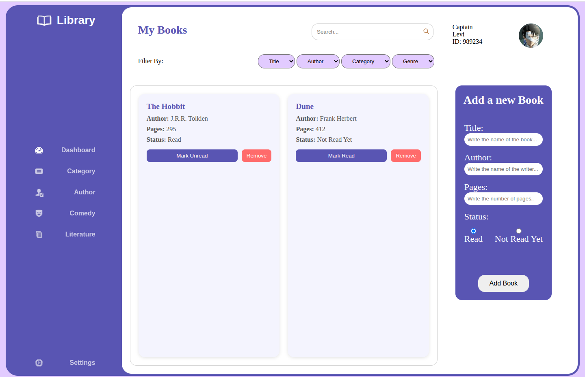

# Library Management App

A clean, responsive library management web application built with HTML, CSS, and JavaScript that allows users to:

- Add books to their digital library
- Track reading status (Read/Not Read Yet)
- Remove books from the collection
- View all books in an organized grid layout

## Features

📚 **Book Management**
- Add books with title, author, page count, and reading status
- Toggle between "Read" and "Not Read Yet" status
- Remove books from your collection

🎨 **Modern UI**
- Clean sidebar navigation
- Responsive grid layout for book display
- Interactive form for adding new books
- Visual status indicators (green for read, orange for unread)

⚡ **Performance**
- Client-side storage using JavaScript arrays
- Efficient DOM updates
- Event delegation for optimal performance

## Technologies Used

- **Frontend**: HTML5, CSS3, JavaScript (ES6)
- **Styling**: CSS Grid, Flexbox, CSS Variables
- **Build**: Pure vanilla JS (no frameworks or libraries)

## How to Use

1. Fill out the "Add a new Book" form with:
   - Book title
   - Author name
   - Number of pages
   - Reading status (Read/Not Read Yet)

2. Click "Add Book" to add it to your library

3. Manage your books:
   - Click "Mark Read"/"Mark Unread" to toggle status
   - Click "Remove" to delete a book

## Installation

No installation required! Simply open the `index.html` file in any modern web browser.

## Project Structure

```
library-app/
├── index.html        # Main HTML file
├── styles.css        # All styling
├── script.js         # Main application logic
└── Assets/           # Contains all images and icons
    ├── Avatar.png
    ├── Icon/
    │   ├── Open Book.png
    │   ├── Speed.png
    │   └── ...other icons
```

## Customization

To customize the app:

1. **Colors**: Modify the CSS variables in `:root`
   ```css
   :root {
     --ColorOne: #5955B3;
     --ColorTwo: #F4F4FE;
     --ColorThree: #E2CBFF;
   }
   ```

2. **Layout**: Adjust the grid settings in `.libraryDock`
   ```css
   grid-template-columns: repeat(auto-fill, minmax(280px, 1fr));
   ```

3. **Book Display**: Modify the `.bookCard` styles

## Future Improvements

- [ ] Add local storage persistence
- [ ] Implement search/filter functionality
- [ ] Add book categories/genres
- [ ] Dark mode toggle

## Screenshots

 *Example of the library interface*

## License

This project is open source and available under the MIT License.